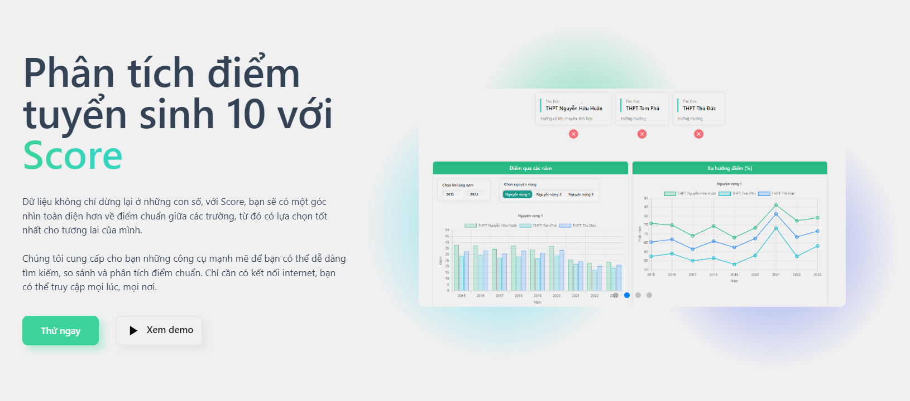

 

  

  <h1 align="center">Score Generation II</h1>

  

    Dữ liệu không chỉ dừng lại ở những con số, với Score, bạn có thể khai thác nhiều hơn thế nữa.
     
    <a href="https://score-gen2.vercel.app/docs/"><strong>Explore the docs »</strong></a>
     
     
  

## 1. Tổng quan về dự án

- Score là một hệ thống website hỗ trợ phụ huynh và học sinh tra cứu điểm chuẩn tuyển sinh 10 tại TP.HCM từ năm 2015 đến nay. Trong đó, người dùng sẽ được tiếp cận nhiều chức năng phân tích và trực quan hóa dữ liệu khác nhau với giao diện web đơn giản và tương thích tốt trên nhiều loại thiết bị.

- Khác với các trang web tra cứu thông tin thường thấy trên Internet, Score không chỉ hiển thị đầy đủ điểm chuẩn tuyển sinh của tất cả các trường THPT trong Thành phố Hồ Chí Minh mà còn đưa ra các nhiều chức năng phân tích dữ liệu (sắp xếp dữ liệu, xếp hạng, thống kê, đề xuất), trực quan hóa các số liệu bằng biểu đồ và xuất các báo cáo theo yêu cầu người dùng.

## 2. Tính năng nổi bật
+ Tìm kiếm bằng tên trường, loại trường, năm học. Không những thế, bạn còn có thể xem chi tiết về thông qua trang chính thức vị trí trường trên bản đồ.
+ Dựa vào trung bình cộng điểm các năm, hệ thống sẽ tự đề xuất những trường có điểm phù hợp với chỉ tiêu đề ra. Bạn có thể lựa chọn loại trường, nguyện vọng, khu vực và các chức năng sẵn có để lọc.
+ Dữ liệu được trực quan hoá qua biểu đồ, bảng, đồ thị. Bạn có thể dễ dàng so sánh, phân tích và đánh giá thông tin một cách nhanh chóng và chính xác.
+ Không chỉ dừng lại ở việc tra cứu, bạn còn có thể tạo các mục với thông số tuỳ chọn để hiển thị. Đồng thời, bạn còn có thể sắp xếp, chỉnh sửa và lưu trữ dữ liệu của mình để sử dụng sau này.

## 3. Có gì mới so với Gen 1

| | Gen 1 | Gen 2 |
| :---- | :---: | :---:|
|Tìm kiếm trường bằng tên, năm học, khu vực| có | có |
| Lọc trường theo khoảng điểm, thứ tự | có | có |
| Hiển thị điểm dưới dạng đồ thị (có thể tuỳ chỉnh) | có | có |
| Font chữ dễ nhìn |  | có |
| Truy cập ổn định hơn | | có |
| Lấy thông tin nhanh hơn | | có |
| Thông tin chi tiết về trường | | có |
| So sánh thông qua biểu đồ (tối đa 3 trường) | | có |
| Tự chọn mục để in | | có |
| Không giới hạn số lượng mục in | | có |
| Sắp xếp, chỉnh sửa, lưu các mục | | có |

### 4. Built With

Những framework/package/tool được sử dụng trong quá trình xây dựng.

## 5. License

Phân phối theo Giấy phép MIT. Xem [LICENSE](LICENSE) để biết thêm thông tin.

## 6. Contact

   
  